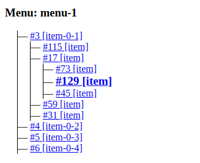
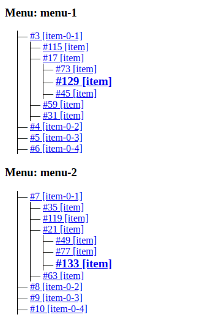

# django-menu

## Description

Django application allows to create menu with some items with infinity nesting and draw it inside templates with `draw_menu` tag.

The created menu tree contains the active item, its child items of the first nesting level, and all items with a nesting level lower than the active one.

The menu active item determined based on the URL address, for example: for the URL `https://example.com/menus/?menu-1=46&menu-2=129` for `menu-1` the active item ID is `46` and for `menu-2` - `129`.



Also template may to contain multiple menus.



## Installation

Clone this repository.

```bash
git clone https://github.com/ArtyomYaprintsev/django-menu
```

Move into the created directory and install requirements.

```bash
pip install -r requirements.txt
```

### Requirements

Project uses the [django](https://github.com/django/django) to build main functionality and [django-debug-toolbar](https://github.com/jazzband/django-debug-toolbar) for debug (to check queries count in general).

### Demonstration

For demonstration the repository contains `db.sqlite3` db.

The database contains a superuser with the credentials `admin` and `adminPassword`, as well as 4 menus with some items.

Run the server with:

```python
python manage.py runserver
```

And go the <http://localhost:8000/menus/>.

## Usage

Load the `draw_menu` template tag and call it with the specific menu name inside your template.

```html


...

...
```
